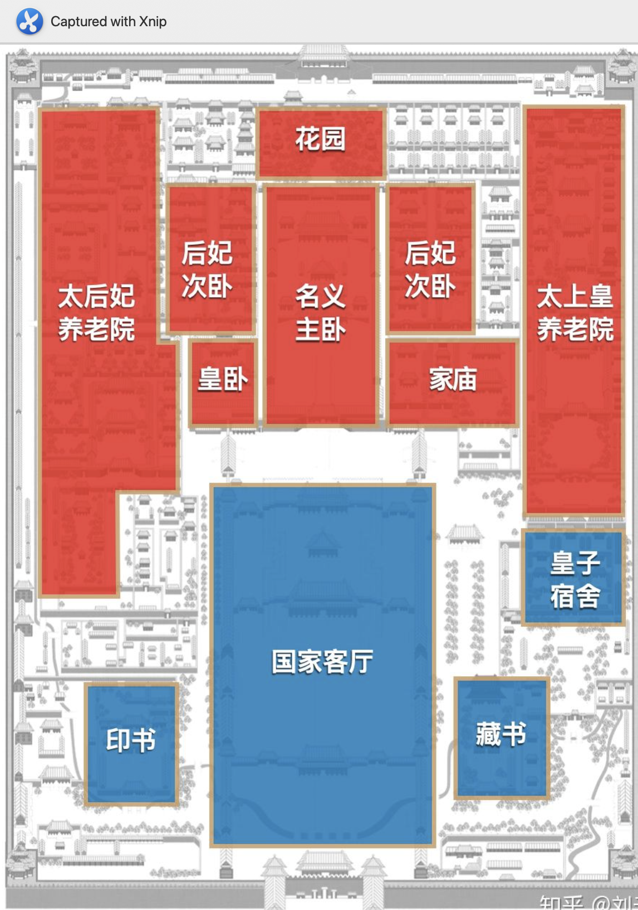
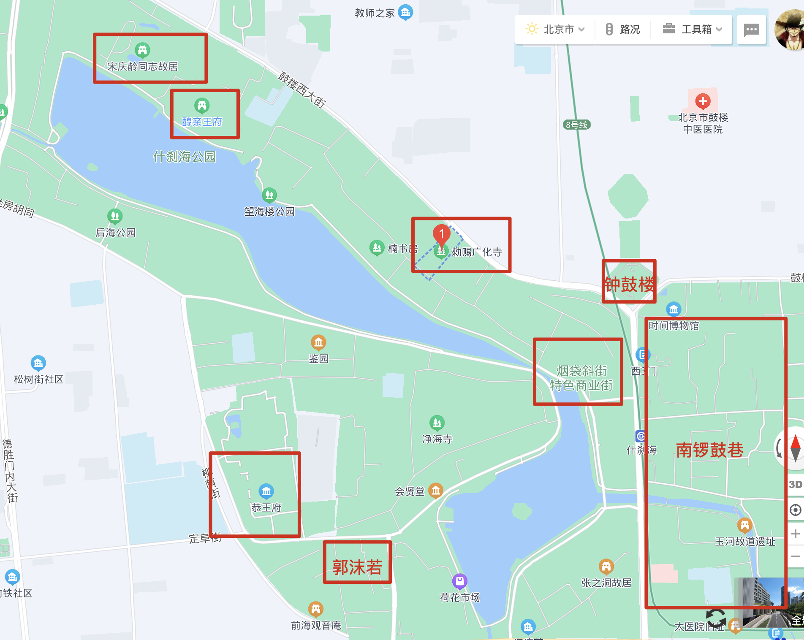

#### 背景

十一国庆北京旅游，9月30日当天到，10月5日离开，共四天

1. 衣：十月北京较冷，需要准备秋冬衣物，天气大概12～22度左右

2. 食：大部分名胜古迹内无餐饮，需要自带。市内景区有北京特色餐厅，郊区有农家乐

3. 住：家里；旁边酒店；三环附近酒店

4. 行：市内坐地铁，郊区开车（节假日不限行，但十一不建议堵车，难停车）

注：身份证，天天做核酸检测

- #### 第一天半天：到北京
  
  1点半：飞机落地
  
  - **天坛**（皇帝祈福地方，备选）
    
    下午两点：从大兴机场出发-> 天坛公园（1小时）
    
    - 时间：6:00\-22:00（门区需16点前，21:00停止入园）
    
    - 预约：当天或提前一天，飞猪, **斋宫、神乐署**联票不包含。
    
    - 攻略：3小时
      
      天坛东门->七十二长廊->皇乾殿->祈年殿->丹陛桥->皇穹宇->回音壁->圜丘->南门出。
    
    - 小吃：左邻右舍褡裢火烧有很多正宗小吃，如老磁器口豆汁儿店、褡裢火烧、麻豆腐、炸灌肠、芥末墩、酥鲫鱼等
  
  - 回酒店休息
    
    - 逛一下商场
      
      - 买手机
      
      - 买东西
    
    5点左右去吃饭
    
    - 老北京火锅
      
      - 清真百友顺涮肉城(故城东路店)
      
      - 京九门（北关店）
      
      - 京匠铜锅(物资学院店)
    
    - 旺顺阁 鱼头泡饼（万达）
    
    - 烤鸭- 大鸭梨烤鸭

- #### 第二天： 天安门-毛主席纪念堂-故宫-景山公园
  
  路线： 天安门->毛主席纪念堂->故宫 ->  (景山->鸟巢水立方)
  
  - **天安门**
    
    - 时间：9.30 晚9点至少， 早6:10 升旗
    
    - 预约：持故宫预约直接进入，无须提前预约
    
    - 携带：建议背包，身份证，零食，小板凳，多穿衣服，羽绒服，厚衣服
    
    - 备注：尽可能早到，晚上较冷，需备棉衣服
  
  - **毛主席纪念堂**
    
    - 时间：10.1 8～11点
    
    - 预约：毛主席纪念堂微信服务号，提前1-6天
    
    - 携带：不可携带任何东西，存包处国家博物馆南侧
    
    - 备注：观完升旗，要尽快排队，预计1～2小时
  
  - **故宫博物院**
    
    
    
    - 时间：8:30～16:00
    
    - 预约：故宫博物院公众号，提前1-7天； 飞猪
    
    - 携带：背包，身份证，零食
    
    - 攻略：
      
      1. 从穿过天安门、端门再到午门或者从东/西华门进入，到午门（**南门入人多**）
      
      2. 先到午门内左侧扫码预约观看展馆，午门西侧存包，两个小时运到北门
      
      3. 租赁讲解器或者电子讲解
      
      4. 金水桥(仁义礼智信) -> 午门(故宫600年大展) -> 三大殿（太和殿、中和殿、保和殿）
         
         1. 中轴线上后三宫及御花园（乾清宫、交泰殿、坤宁宫）
         
         2. 西线上的西六宫及养心殿、慈宁宫、储秀宫(收集印章)
         
         3. 东线上的东六宫及延禧宫、奉先殿（钟表馆）、宁寿宫（珍宝馆）
         
         4. 由西向东回到中轴
  
  - **景山公园**（鸟瞰故宫，备选）
    
    - 时间：6:00～21:00
    
    - 预约：畅游公园公众号，提前1-7天
    
    - 携带：身份证
    
    - 攻略：鸟瞰故宫
  
  - **鸟巢-水立方**（体育馆，备选）1小时 （拍夜景）
    
    - 时间：10:00\-18:00 (16:30停止售票) 或夜场票
    
    - 预约：可当天买，飞猪
    
    - 攻略：
      
      - 白天：顶美空中走廊；
      
      - 夜晚有夜景，
      
      - 附近有商场，奥森公园，国家会议中心
  
  - **天坛**（皇帝祈福地方，备选）
    
    - 时间：6:00\-22:00（门区需16点前，21:00停止入园）
    
    - 预约：当天或提前一天，飞猪, **斋宫、神乐署**联票不包含。
    
    - 攻略：3小时
      
      天坛东门->七十二长廊->皇乾殿->祈年殿->丹陛桥->皇穹宇->回音壁->圜丘->南门出。
    
    - 小吃：左邻右舍褡裢火烧有很多正宗小吃，如老磁器口豆汁儿店、褡裢火烧、麻豆腐、炸灌肠、芥末墩、酥鲫鱼等
    
    - 
    
    - 午餐：
  1. 保和殿东侧-故宫餐厅，中和殿-西侧-故宫冰窟餐厅
  
  2. 前面大街，老北京火锅，全聚德，东来顺，爆肚、卤煮，炒肝、全聚德烤鸭、都一处烧麦、月盛斋酱肉、前门张记涮肉、四季民福烤鸭等

- #### 第二天：南锣鼓巷-恭王府-什刹海
  
  
  
  路线：南锣鼓巷->钟鼓楼?->恭王府->郭沫若故居->荷花市场-> 烟袋斜街->广化寺->醇亲王府->宋庆龄故居
  
  - **南锣鼓巷**（美食、艺术、步行街）
    
    - 时间：24h， 由南向北（800m）
    
    - 攻略：玩， 文宇酸奶（酸奶，酸梅汤） 过客、创可贴-8、多以酒吧闻名
    
          景点：齐白石纪念馆、矛盾故居等（没啥玩的）
  
  - **恭王府**
    
    - 时间：8:30～12  1:00～16:00
    
    - 预约：提前1天即可，淘宝，飞猪
    
    - 攻略：
      
      一小时游览线路：一宫门-银安殿-葆光室-锡晋斋-后罩楼-西洋门-独乐峰-蝠池-福字碑-方塘水榭-榆关-箭道。共12个景点。
      
      二小时游览线路：一宫门-银安殿-嘉乐堂-葆光室-锡晋斋-后罩楼-西洋门-独乐峰-蝠池-安善堂-流杯亭-竹子院-牡丹园-怡神所-蝠厅-平步青云路-邀月台-滴翠岩-福字碑-方塘水榭-妙香亭-龙王庙-箭道-乐道堂-多福轩。共25个景点。
      
      半日游览线路：一宫门-银安殿-嘉乐堂-葆光室-锡晋斋-抱厦-后罩楼-西洋门-独乐峰-蝠池-安善堂-流杯亭-蓺蔬圃-垂花门-竹子院-牡丹园-怡神所-蝠厅-平步青云路-邀月台-滴翠岩-福字碑-诗画坊-凌倒景-方塘水榭-妙香亭-榆关-龙王庙-箭道-乐道堂-多福轩-中华传统技艺精品馆。共32个景点。
  
  - **什刹海**（美食、艺术、步行街）
    
    可关注 **什刹海文化探访路** 小程序，浏览
    
    - 时间：24h
    
    - 攻略：宋庆龄故居、郭沫若故居、烟袋斜街、钟鼓楼、
    
    - 美食：苏造肉、莲子粥、全聚德烤鸭

- #### 第三天：圆明园 或 颐和园+簋街
  
  - **圆明园（已被烧毁皇家公园）**
    
    - 时间：7:00\-18:00
    
    - 预约：飞猪/圆明园遗址公园小程序， 圆明园微导览
    
    - 美食：园内无餐厅，自带零食
    
    - 攻略：
      
      必看景点：西洋楼遗址景区、大水法、迷宫、全景沙盘、银杏大道
      
      - 电瓶车
        
        乘车线: 正觉寺（马首展）→涵秋馆→仙人承露→三园交界→三园交界（西洋楼线乘车）→曲院风荷（乘车）→濂溪乐处（乘车）→多稼如云（乘车）→鱼跃鸢飞（乘车）→北远山村（乘车）→（步行路程）遗址西口→西洋楼遗址→遗址东口→全景沙盘→狮子林→东门出（约2.5小时）
      
      - 步行/租赁脚踏车
        
        租车/还车地点是：三园交界，藻园门，西洋楼遗址
        
        - 秋季线：南门→涵秋馆（菊花）→三园交界→银杏大道（银杏）→西洋楼遗址
        
        - 联票: 二宫门→澹怀堂→含经堂→全景沙盘→遗址东口→西洋楼遗址→遗址西口→银杏大道→三园交界→三孔桥（文创）→仙人承露→涵秋馆→鉴碧亭（文创）→南门（约3小时）
      
      [圆明园地图导览图](http://www.yuanmingyuanpark.cn/pw/kdt/202004/t20200430_4402331.html)
      
      [2022北京圆明园国庆金秋游活动攻略（时间+门票）- 北京本地宝](http://bj.bendibao.com/news/2021926/300591.shtm)
  
  - **颐和园**（皇家公园）
    
    - 时间：6:0～19:00
    
    - 预约：颐和园公众号，飞猪
    
    - 攻略：
      
      必看：苏州街、佛香阁、长廊、十七孔桥
      
      
      
      
    
    - 美食：听鹂馆饭庄，建议自带部分干粮
  
  - **簋街**（小吃街，东直门内大街）  
    
    - 时间：建议下午晚上去
    
    - 攻略：独一味万州烤鱼、胡大饭馆、簋街仔仔小龙虾、嘉陵楼馋嘴城、独门冲（麻辣烤鱼）、宽板凳老灶火锅、翼栈餐吧、哈哈镜鸭脖子等

- #### 第四天：长城+明十三陵+德云社
  
  - **长城**
    
    美食：周边无餐饮，只有入口处有农家乐，建议自带应急干粮
    
    长城都在郊区，建议自驾游或跟团
    
    - 八达岭长城
      - 时间：6:30\-19:00
      - 攻略：`不到长城非好汉`的好汉碑，最有名，保存最好，最拥挤
    - 慕田峪长城
      - 时间：7:30\-17:30
      - 攻略：风景好，人少，适合拍照
    - 居庸关长城
      - 时间：8:00\-17:00
      - 攻略：比八达岭要陡峭，台阶更高，有的地方也并不平整，登长城需要有更好的体力。
    - 司马台长城
      - 时间：8:00\-18:00
      - 攻略：我国唯一一段保留明长城原貌的古长城，适合看红叶，十月中下旬。请至少提前一天预约，按规定时段分批次集中乘坐免费摆渡车至长城脚下。进入长城景区参观，预约成功保证游览名额。约游览批次：每天三批（10:00、12:00、14:00）
    - 黄花城水长城
      - 时间：8:00\-17:00
      - 攻略：“山间碧玉，水中长城”
    - 金山岭长城
      - 时间：6:00\-19:00（大门口24小时有人值班，开放时间根据日出日落时间适当调节，但景区内不可过夜）
      - 攻略：夏秋两季雨后的云雾和彩虹，在金山岭长城上拍摄日出日落也较为流行，摄影爱好者可以考虑在附近住宿一晚以便拍摄。
  
  - **明十三陵**
    
    十三位皇帝陵墓分别为：长陵(成祖)、献陵(仁宗)、景陵(宣宗)、裕陵(英宗)、茂陵(宪宗)、泰陵(孝宗)、康陵(武宗)、永陵(世宗)、昭陵(穆宗)、定陵(神宗)、庆陵(光宗)、德陵(熹宗)、思陵(思宗)。
    
    景区已开放景点有**神路->定陵->长陵(->昭陵?)**。
    
    - 时间：
      
      　　定陵：08:00~17:30
      
      　　长陵：08:00~17:00
      
      　　昭陵：08:30~17:00
      
      　　神道：08:10~17:50
    
    - 交通：自驾或地铁
    
    - 预约：明十三陵公众号/携程
    
    - 攻略：德胜门坐872路地铁或自驾，各个陵园距离较远，有公交车
  
  - **德云社**
    
    - 时间：10月暂无排期

- #### 餐饮
  
  - **美食街**
    
    - 后海-烟袋斜街美食推荐：炒肝、驴肉火烧、炸灌肠、李记烧饼、馄饨侯、北锣褡裢火烧等。
    
    - 南锣鼓巷：吉事果、烈火鱿鱼王、八口厚吐司等。
    
    - 簋街：羊蝎子、麻辣小龙虾、卤煮火烧、独一味万州烤鱼、馋嘴蛙等
    
    - 牛街
    
    - 前门大栅栏
  
  - **美食**：烤鸭、铜锅涮肉、炸酱面、爆肚、羊蝎子、麻辣小龙虾、卤煮火烧、驴打滚、老北京炸酱面、豆汁配焦圈、豌豆黄
    
    - **烤鸭（老字号品牌**）：全聚德、便宜坊、大董、四季民福 （优先推荐后三个~）
    
    - **涮肉**：东来顺、一条龙
    
    - **特产**：六必居酱菜、月盛斋羊（牛）肉
    
    - **稻香村糕点**（认准三禾标志）取曹雪芹名著《红楼梦》中大观园的稻香村为名
    
    - **果脯**（牌子）：红螺牌、御食园牌
  
  - **店铺**：北京烤鸭（便宜坊/全聚德），东来顺（铜炉火锅）、一条龙饭庄（铜炉火锅）、鸦儿李记（银锭桥店）护国寺小吃、庆丰包子铺、小吊梨汤、望京小腰，
  
  - **京系餐厅：京味斋、海碗居、老舍茶馆（京剧）**
    
    - **京味斋**:浓浓的京味儿元素设计，店员的服务也很到位。国宴牡丹烤鸭，花开富贵，色泽红润，肉质是肥而不腻，外脆里嫩。地道的老北京烤鸭，是连皮带肉一起夹，蘸酱加上青瓜卷着面皮一起吃。好看又好吃的京八件，连豌豆黄都做得非常精致。  
    
    - **海碗居**:很有北京特色的炸酱面,一进门香味铺面而来，二的吆喝地动山摇，装修也蛮有老北京风格的。炸酱面每次必吃，一大碗端上来，酱香十足，菜码丰富得吓人。  
    
    - **老舍茶馆（京剧）**：老舍茶馆是一个感受京味文化的好地方，悠闲地喝茶，静静地听戏，偶尔跟着懂行的票友一起叫好。你会真的舍不得离开。  
